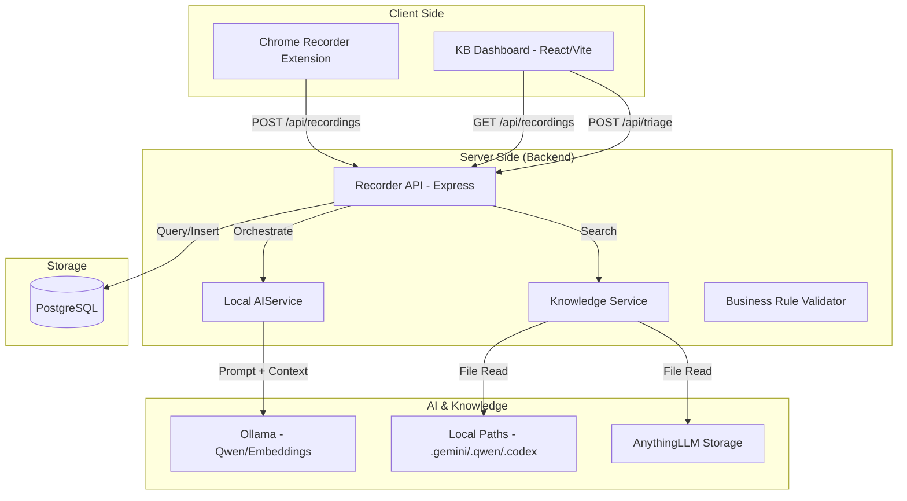

# AI-Aero Testing Platform: System Architecture & Data Flow Analysis

This document provides a deep-dive analysis of the platform's internal connections, data flow, and AI-driven orchestration.

## 1. High-Level Architectural Overview

The system is designed as a local-first, AI-assisted platform for testing complex business rules. It follows a decoupled architecture where each component has a specific responsibility.

## 2. Component Connection Details

### A. UI (Frontend) & Backend Connection
- **Mechanism**: Standard RESTful API calls using `fetch`.
- **Endpoints**:
  - `GET /api/recordings`: Populates the dashboard sidebar with history.
  - `GET /api/recordings/:id`: Retrieves detailed session data (steps, metrics).
  - `POST /api/triage/:id`: Triggers the AI-assisted analysis for a specific failure.
  - `GET /api/search?q=...`: Queries local knowledge bases for past fixes.

### B. AI, Backend, and Frontend Connection
- **Orchestration**: The Backend acts as the "Brain" between the UI and the AI.
- **Workflow**:
  1. UI requests triage.
  2. Backend fetches session data from PostgreSQL.
  3. **`ContextManager`** trims the session logs to fit token limits.
  4. **`SkillRegistry`** selects the `ROOT_CAUSE_ANALYSIS` prompt template.
  5. **`LocalAIService`** sends a structured request to **Ollama** (requesting JSON).
  6. Ollama returns a diagnosis.
  7. Backend passes the JSON diagnosis back to the UI for rendering in the "AI Triage" card.

### C. UI -> API -> Backend -> Database Connection
- **Data Flow**:
  - **Capture**: The Extension monitors DOM events and Network requests -> sends to API -> Backend inserts JSONB data into PostgreSQL.
  - **Retrieval**: UI requests a session -> API queries PostgreSQL -> Backend serializes JSONB -> UI renders the timeline/metrics.

## 3. Advanced Orchestration Results

### AI Skill Management
The system uses a modular **Skill Registry** (OpenClaw-style). This allows the platform to perform different AI tasks (Selector Repair vs. Root Cause Analysis) without specialized backend routes for every atomic task.

### Token & Context Control
To prevent "hallucination" or model overload, the **`ContextManager`** enforces a 4096-token window by prioritizing the *latest* events and the *initial* system prompt, ensuring the AI always has the most relevant context for debugging.

## 4. Testing Methodology Results

The platform integrates a "Shift-Left" testing methodology:
- **Unit**: Business rules are validated at the logic level before UI integration.
- **E2E**: Playwright replays capture real-world discrepancies.
- **Performance**: Double-layered testing with `k6` (developer CI) and `JMeter` (enterprise load).
- **Security**: OWASP ZAP scanning ensures the API layer is resilient against common vulnerabilities.

---
**Conclusion**: The system is a robust, tightly integrated platform that leverages local AI to bridge the gap between automated testing and manual root-cause analysis.
